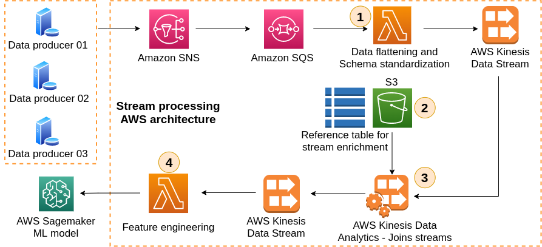

# Demo Streaming Process Pipeline Setup

## Introduction

This code repository aims at shares the resources described in this <a href=https://medium.com/@guilhermeepassos/joining-and-enriching-multiple-sets-of-streaming-data-with-kinesis-data-analytics-24b4088b5846> article.</a> 
The image below shows an AWS architecture of a data pipeline that uses Kinesis Data Analytics for joining and enriching three sets of streaming data in real-time.
The architecture shown below is coded here, and it can be easily deployed in your AWS
environment. 
<p align="center">
  
  <br/>
</p>

## Installation<a name="w2402aac23c29c11b5"></a>
 ****Requirements****
+ AWS Access and Secret Keys with enough privileges to deploy S3 buckets, Lambdas, SNS, SQS, Cloudwatch logs, Kinesis Data Stream and Kinesis Data Analytics on your account.
+ Terraform >= 0.12 

 **Local Deployment** 
1. Clone this repository
```
git clone https://github.com/gpass0s/streaming-processing-on-aws.git
```
2. Access this project's infra as code folder 
```
cd streaming-processing-on-aws/infra-as-code
```
3. Set your AWS credentials as local environment variables 
```
export AWS_ACCESS_KEY_ID=<your-aws-access-key-id>
export AWS_SECRET_ACCESS_KEY=<your-aws-secret-access-key>
export AWS_DEFAULT_REGION=<your-aws-region>
```
4. Initiate terraform 
```
terraform init
```
5. Create a terraform plan
```
terraform plan
```
6. Apply resources in your account. If you get any error at this stage, 
execute again the command below.
```
terraform apply
```